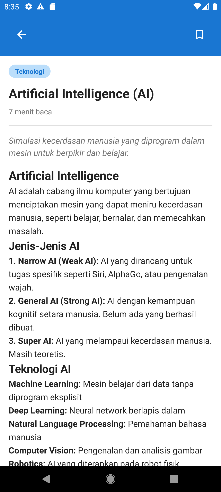

# Nemopedia

Nemopedia adalah aplikasi edukasi berbasis Android yang dikembangkan sebagai proyek UAS pada mata kuliah Pemrograman Bergerak. Aplikasi ini dirancang untuk memberikan akses informasi dan pembelajaran secara digital melalui perangkat mobile. Aplikasi ini menyediakan antarmuka yang sederhana, navigasi yang mudah dipahami, serta fitur yang mendukung pengalaman belajar yang efektif.

---

## Tag Aplikasi

education, learning, encyclopedia, student, mobile learning, android app

---

## 📱 Informasi Aplikasi

- **Nama Aplikasi**: Nemopedia  
- **Kategori**: Education  
- **Platform**: Android  
- **Bahasa Pemrograman**: Kotlin  
- **Tools**: Android Studio  

---

## Tujuan Pengembangan

Aplikasi Nemopedia dikembangkan untuk memenuhi Sub-CPMK:
> Mempersiapkan publikasi aplikasi bergerak yang telah dibangun sesuai aturan dan ketentuan komunitas yang berlaku.

Proyek ini merupakan kelanjutan dari Proyek UTS hingga tahap siap publikasi.

---

## Fitur Utama

- Antarmuka pengguna sederhana dan mudah digunakan  
- Navigasi aplikasi yang jelas  
- Menampilkan informasi edukatif  
- Siap dipublikasikan dalam bentuk Android App Bundle (.aab)  

---

## File Rilis Aplikasi

Android App Bundle (.aab) dapat diakses melalui link berikut:
[Download App Bundle (.aab)](app/release/app-release.aab)

---

## Video Demo Aplikasi

---

## Tampilan Aplikasi

### Tampilan pada Perangkat Smartphone

**Tampilan Utama**

**Halaman Artikel**

---

### Tampilan pada Perangkat Tablet

**Tampilan Utama**

**Halaman Artikel**

---

## Icon Aplikasi

Icon resmi aplikasi Nemopedia (512x512 PNG):

---

## Kebijakan Privasi

Kebijakan Privasi dapat diakses pada file berikut:
[Privacy Policy](docs/privacy-policy.md)

---

## Kontak Developer

Jika terdapat pertanyaan atau masukan, silakan hubungi: vdila615@gmail.com

